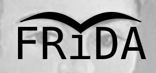

## FRee Interactive DisAssembler  
Copyright (C) 2017,2023 by Ivo van Poorten  
Created with QtCreator 4.14.1 and Qt 5.15.2  

##### Runs on:
* Linux, debian 11.6 bullseye (stable), and equivalents  
* Windows 10, and above  
* macOS Catalina 10.15.7, and above  
* FreeBSD 13.2  
* OpenBSD 7.2  

##### Supported CPUs:
* NMOS 6502  
* NMOS 6502 w/ undefined opcodes  
* CMOS 65C02  
* Intel 8080  

##### File formats:
* Raw  
* Atari 8-bit Binary (.XEX)  
* Atari 8-bit Slight Atari Player (.SAP)  
* Atari 8-bit Cartridge (.CAR)  
* Commodore PET/VIC-20/C16/C64/C128 Binary (.PRG)  
* Commodore C64 PSID/RSID (.SID)  
* Atari 2600 2K/4K ROM (.A26)  
* Oric Tape File (.TAP)  
* Apple ][ DOS3.3 4-byte header  
* Apple ][ ProDOS AppleSingle  
* Nintendo NES Song File (.NSF)  
* CP/M Binary at 0100H (.COM)  
* BBC Micro, Electron, Master UEF Tape (.UEF)  

##### Build instructions:
```
git clone https://github.com/ivop/frida  
cd frida  
mkdir build  
cd build  
qmake ../src/frida.pro  
make -j8  
```

###### Notes:  

* Use latest Qt5 5.15.x.   
* Linux builds with both clang++ and g++.  
* Windows builds with MinGW-g++, MS compiler is not supported.  
* macOS builds with clang++ that comes with XCode.  
* FreeBSD builds with clang++. gcc9 and gcc10 give an ICE (internal compiler error), gcc11 and gcc12 have broken PCH support.  
* OpenBSD builds with eg++.  
