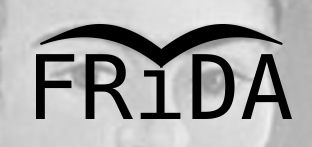

FRee Interactive DisAssembler

qtcreator project

Limitted to NMOS6502 and Atari/C64 file formats, but the framework is meant
to support all kind of processors and platforms.

Build instructions:

qmake frida.pro

make
